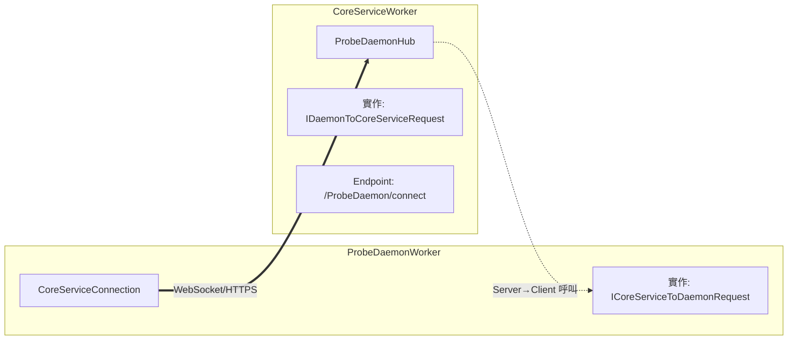

# PIXIS ProbePortWorker 與 CoreServiceWorker 通訊架構分析

> **文件日期**: 2026-01-07

---

to-do

1. CoreServiceWorker 沒有作為 Hub 回傳
2. ProbePortWorker 直接和 18000 Port 建立 SignalR 通訊
3. DaemonWorker 不需要透過 Proxy 和 CoreServiceWorker 溝通

# ProbeDaemonWorker ↔ CoreServiceWorker SignalR 連線

## 連線端點

| 元件   | 檔案                                                       | 端點                                           |
| ------ | ---------------------------------------------------------- | ---------------------------------------------- |
| Client | `PIXIS.ProbeDaemonWorker/SignalR/CoreServiceConnection.cs` | `https://{ServerEndPoint}/ProbeDaemon/connect` |
| Server | `PIXIS.CoreServiceWorker/SignalR/ProbeDaemonHub.cs`        | MapHub at `/ProbeDaemon/connect`               |

## 連線設定 (Client 端)

```csharp
this.connection = new HubConnectionBuilder()
    .WithUrl($"https://{daemonStatus.ServerEndPoint}/ProbeDaemon/connect", opt =>
    {
        opt.Headers.Add("X-ProbeDaemon-ID", daemonStatus.ProbeDaemonId.ToString());
        opt.SkipNegotiation = true;
        opt.Transports = HttpTransportType.WebSockets;
    })
    .WithAutomaticReconnect([TimeSpan.Zero])
    .Build();
```

## 雙向通訊方法

| 方向                     | 介面                          | 方法                                                                                                                                                |
| ------------------------ | ----------------------------- | --------------------------------------------------------------------------------------------------------------------------------------------------- |
| **Daemon → CoreService** | `IDaemonToCoreServiceRequest` | `ProbeDaemonLogin()`, `GetPortWorkerInitData()`, `GetProbeHAGroupInfo()`, `ReportDaemonState()`, `ProxyPortWorkerMessage()`, `GetX509Certificate()` |
| **CoreService → Daemon** | `ICoreServiceToDaemonRequest` | `StartPortWorker()`, `UpdateDaemonLogRetentionDays()`, `NotifyHttpsCertificateChanged()`                                                            |

## 認證機制

- **Header**: `X-ProbeDaemon-ID`
``` C#
opt.Headers.Add("X-ProbeDaemon-ID", daemonStatus.ProbeDaemonId.ToString());
```
- **Policy**: `ProbeDaemonIdRequirement`
- **UserIdProvider**: `DaemonIdProvider`  從 Header 提取 ID

## 架構圖



```
┌─────────────────────────────────────────────────────────────────────────┐
│                        IProbeDaemonHub                                  │
│              (PIXIS.Core.Service.Interface - 共用層)                     │
├─────────────────────────────────────────────────────────────────────────┤
│                                                                         │
│ 繼承 Hub<ICoreServiceToDaemonRequest>   實作 IDaemonToCoreServiceRequest │
│   ┌─────────────────────────────┐           ┌─────────────────────────┐ │
│   │   Server → Client 方法       │          │   Client → Server 方法   │ │
│   │   (透過 Clients 屬性呼叫)     │          │   (Hub 的公開方法)        │ │
│   │                             │           │                         │ │
│   │ • StartPortWorker()         │           │ • ProbeDaemonLogin()    │ │
│   │ • UpdateDaemonLogRetention  │           │ • GetPortWorkerInitData │ │
│   │ • NotifyHttpsCertChanged    │           │ • ReportDaemonState()   │ │
│   └─────────────────────────────┘          └ ─────────────────────────┘ │
│                                                                         │
│                    ↑ 兩者結合 = 完整的雙向通訊 Hub                         │
│                                                                         │
└─────────────────────────────────────────────────────────────────────────┘
                                    │
                                    │ 繼承
                                    ▼
┌─────────────────────────────────────────────────────────────────────────┐
│                          ProbeDaemonHub                                 │
│                  (PIXIS.CoreServiceWorker - Server 層)                  │
├─────────────────────────────────────────────────────────────────────────┤
│    override 所有 abstract 方法，提供實際實作                               │
└─────────────────────────────────────────────────────────────────────────┘
                                    │
                                    │ DI 註冊
                                    ▼
┌─────────────────────────────────────────────────────────────────────────┐
│                            Startup.cs                                   │
├─────────────────────────────────────────────────────────────────────────┤
│  // DI 註冊：IProbeDaemonHub → ProbeDaemonHub                            │
│  services.AddTransient<IProbeDaemonHub, ProbeDaemonHub>();              │
│                                                                         │
│  // 端點註冊：使用 IProbeDaemonHub 類型                                    │
│  endpoints.MapHub<IProbeDaemonHub>("/ProbeDaemon/connect");             │
│                              ↓                                          │
│                     DI 解析為 ProbeDaemonHub                             │
└─────────────────────────────────────────────────────────────────────────┘

```

## 總結

| 元件                            | 職責                    | 位置                         |
| ----------------------------- | --------------------- | -------------------------- |
| `ICoreServiceToDaemonRequest` | 定義 Server → Client 方法 | PDI (共用)                   |
| `IDaemonToCoreServiceRequest` | 定義 Client → Server 方法 | PDI (共用)                   |
| `IProbeDaemonHub`             | 組合兩個介面成為完整 Hub 契約     | Core.Service (共用)          |
| `ProbeDaemonHub`              | 實際實作                  | CoreServiceWorker (Server) |
| `MapHub + AddTransient`       | 註冊端點 + DI 綁定          | Startup.cs                 |

---

### 1. `connection.InvokeAsync()` - Client 呼叫 Server
### 2. `connection.On()` - 註冊處理 Server 呼叫的方法

## 對照表

|方法|方向|用途|對應介面|
|---|---|---|---|
|`connection.InvokeAsync()`|Client → Server|Client 主動呼叫 Server 方法|`IDaemonToCoreServiceRequest`|
|`connection.On()`|Server → Client|註冊處理 Server 來的呼叫|`ICoreServiceToDaemonRequest`|


# PortWorker 直連 CoreService 架構重構計畫

## 目標

移除 `ProbeDaemonWorker` 作為 `ProbePortWorker` 與 `CoreServiceWorker` 之間的 SignalR 代理。讓 `ProbePortWorker` 直接連線至 `CoreServiceWorker`，並具備離線生存能力。

## 執行階段 (Phases)

### Phase 0: 直連通道建設 (✅ 已完成)

確保 PortWorker 物理上能連到 CoreService。

- [x]  **建立 CoreService 連線**: `CanConnect` 至 CoreService HTTPS 端口。
- [x]  **實作登入機制**: 
    
    PortWorkerLogin 已實作。
- [x]  **實作事件回報**: 
    
    ReportEvent 已實作。
- [x]  **接收核心指令**: 
    
    OnStartPortWorker 已實作。

### Phase 1: 離線資料骨架 (✅ 已完成)

賦予 PortWorker 記憶能力 (LiteDB)。

- [x]  **LiteDB 初始化**: 修改 
    
    Startup.cs，註冊 LiteDB 服務。
- [x]  **建立 ILocalDBService 介面**: 定義資料存取合約。
- [x]  **實作 LocalDBService**: 負責 LiteDB 的 CRUD 操作。

### Phase 2: 關鍵資料快取 (⬜ 待執行 - 優先級: 🔴 高)

整合 SignalR，將收到的資料「存起來」。

#### 2.1 實作資料儲存方法

- [ ]  **SavePortWorkerInitData**: 儲存初始化資料 (InitData)。
- [ ]  **SaveX509Certificate**: 儲存 HTTPS 憑證。
- [ ]  **StoreOfflineEvent**: 離線事件暫存。

#### 2.2 整合 SignalR - 修改 CoreServiceConnection.cs

- [ ]  **OnStartPortWorker**: 收到指令時，順手備份 InitData。
- [ ]  **OnNotifyHttpsCertificateChanged**: 收到通知時，順手備份憑證。
- [ ]  **GetX509Certificate**: 增加離線讀取邏輯 (連不上時讀 DB)。

### Phase 3: 離線生存能力 (⬜ 待執行 - 優先級: 🔴 高)

讓 PortWorker 在沒網路時也能啟動。

#### 3.1 修改 CoreServiceConnection.ConnectAsync

- [ ]  **離線啟動邏輯**: 當 `TryConnectToCoreService` 失敗時，嘗試從 LocalDB 讀取設定與 InitData，並寫入 `initPortWorkerChannel` 觸發啟動 (標記為離線模式)。
- [ ]  **背景重連**: 啟動後持續在背景嘗試重連 CoreService。

#### 3.2 修改 MainWorker.cs

- [ ]  **處理離線啟動**: 確保 MainWorker 能正確處理 `initLocally=true` 的情況。

### Phase 3.5: 資料同步機制 (⬜ 新增 - 優先級: 🟡 中)

確保快取資料不會過期。

- [ ]  **新增 CacheSyncWorker**: BackgroundService，定期 (如每 10 分鐘) 當連線正常時，從 CoreService 同步最新的 InitData 與 Certificate。

### Phase 4: 事件補償機制 (⬜ 待執行 - 優先級: 🟡 中)

處理斷線期間產生的資料。

- [ ]  **修改 ReportEvent**: 發送失敗或斷線時，自動轉存 LocalDB。
- [ ]  **新增 OfflineEventUploadWorker**: 連上線後自動掃描 DB 並補傳事件。

### Phase 4.5: CoreService 端改造 (⬜ 新增 - 優先級: 🔴 高)

CoreService 需支援分辨直連與代理連線。

#### 4.5.1 修改 StartPortWorker

- [ ]  **分流邏輯**: 判斷目標 PortWorker 是否在 
    
    PortWorkerConnectionManager (直連) 還是僅在 Daemon 下 (代理)。
- [ ]  **推送指令**: 若直連，使用 
    
    PortWorkerHub 推送；若代理，使用 
    
    ProbeDaemonHub 推送。

#### 4.5.2 修改 ResetPortWorker

- [ ]  **支援直連重置**: 實作直連模式下的重置指令發送。

#### 4.5.3 憑證更新通知

- [ ]  **全面廣播**: 憑證更新時，需同時通知 DaemonHub 與 PortWorkerHub。

### Phase 5: 連線模式決策機制 (⬜ 新增 - 優先級: 🔴 高)

- [ ]  **自動偵測 (推薦)**: CoreService 依據 
    
    PortWorkerConnectionManager 是否有連線來決定傳送路徑。

### Phase 6: 移除舊時代產物 (⬜ 待執行 - 最後步驟)

- [ ]  **PortWorker 端**: 移除 
    
    ProbeDaemonConnection.cs。
- [ ]  **DaemonWorker 端**: 移除 
    
    PortWorkerHub 與相關 Proxy 程式碼。

### Phase 7: 測試與驗證 (⬜ 新增 - 優先級: 🟡 中)

- [ ]  **功能測試**: 線上/離線啟動、模式切換。
- [ ]  **資料驗證**: 快取讀寫正確性。
- [ ]  **壓力測試**: 斷線重連穩定性。

## 進度追蹤

| 階段                     | 狀態    | 優先級  |
| ---------------------- | ----- | ---- |
| Phase 0: 直連通道          | ✅ 完成  | -    |
| Phase 1: LiteDB 骨架     | ✅ 完成  | -    |
| Phase 2: 資料快取          | ⬜ 待執行 | 🔴 高 |
| Phase 3: 離線啟動          | ⬜ 待執行 | 🔴 高 |
| Phase 3.5: 資料同步        | ⬜ 待執行 | 🟡 中 |
| Phase 4.5: CoreService | ⬜ 待執行 | 🔴 高 |
| Phase 5: 連線模式          | ⬜ 待執行 | 🔴 高 |
| Phase 4: 事件補償          | ⬜ 待執行 | 🟡 中 |
| Phase 7: 測試驗證          | ⬜ 待執行 | 🟡 中 |
| Phase 6: 移除舊碼          | ⬜ 待執行 | 🟢 低 |