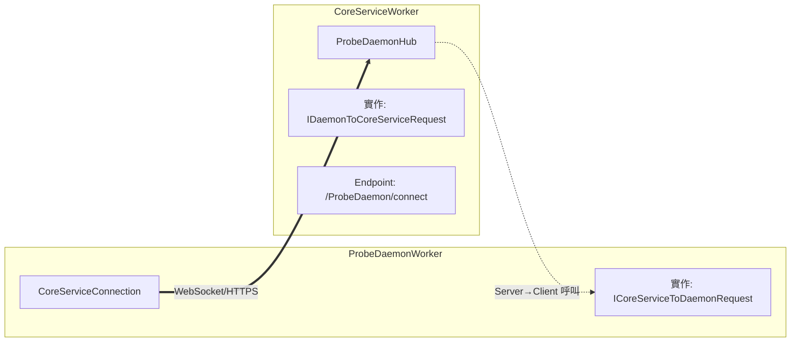

# PIXIS ProbePortWorker 與 CoreServiceWorker 通訊架構分析

> **文件日期**: 2026-01-07

---

to-do

1. CoreServiceWorker 沒有作為 Hub 回傳
2. ProbePortWorker 直接和 18000 Port 建立 SignalR 通訊
3. DaemonWorker 不需要透過 Proxy 和 CoreServiceWorker 溝通

# ProbeDaemonWorker ↔ CoreServiceWorker SignalR 連線

## 連線端點

| 元件   | 檔案                                                       | 端點                                           |
| ------ | ---------------------------------------------------------- | ---------------------------------------------- |
| Client | `PIXIS.ProbeDaemonWorker/SignalR/CoreServiceConnection.cs` | `https://{ServerEndPoint}/ProbeDaemon/connect` |
| Server | `PIXIS.CoreServiceWorker/SignalR/ProbeDaemonHub.cs`        | MapHub at `/ProbeDaemon/connect`               |

## 連線設定 (Client 端)

```csharp
this.connection = new HubConnectionBuilder()
    .WithUrl($"https://{daemonStatus.ServerEndPoint}/ProbeDaemon/connect", opt =>
    {
        opt.Headers.Add("X-ProbeDaemon-ID", daemonStatus.ProbeDaemonId.ToString());
        opt.SkipNegotiation = true;
        opt.Transports = HttpTransportType.WebSockets;
    })
    .WithAutomaticReconnect([TimeSpan.Zero])
    .Build();
```

## 雙向通訊方法

| 方向                     | 介面                          | 方法                                                                                                                                                |
| ------------------------ | ----------------------------- | --------------------------------------------------------------------------------------------------------------------------------------------------- |
| **Daemon → CoreService** | `IDaemonToCoreServiceRequest` | `ProbeDaemonLogin()`, `GetPortWorkerInitData()`, `GetProbeHAGroupInfo()`, `ReportDaemonState()`, `ProxyPortWorkerMessage()`, `GetX509Certificate()` |
| **CoreService → Daemon** | `ICoreServiceToDaemonRequest` | `StartPortWorker()`, `UpdateDaemonLogRetentionDays()`, `NotifyHttpsCertificateChanged()`                                                            |

## 認證機制

- **Header**: `X-ProbeDaemon-ID`
``` C#
opt.Headers.Add("X-ProbeDaemon-ID", daemonStatus.ProbeDaemonId.ToString());
```
- **Policy**: `ProbeDaemonIdRequirement`
- **UserIdProvider**: `DaemonIdProvider`  從 Header 提取 ID

## 架構圖



```
┌─────────────────────────────────────────────────────────────────────────┐
│                        IProbeDaemonHub                                  │
│              (PIXIS.Core.Service.Interface - 共用層)                     │
├─────────────────────────────────────────────────────────────────────────┤
│                                                                         │
│ 繼承 Hub<ICoreServiceToDaemonRequest>   實作 IDaemonToCoreServiceRequest │
│   ┌─────────────────────────────┐           ┌─────────────────────────┐ │
│   │   Server → Client 方法       │          │   Client → Server 方法   │ │
│   │   (透過 Clients 屬性呼叫)     │          │   (Hub 的公開方法)        │ │
│   │                             │           │                         │ │
│   │ • StartPortWorker()         │           │ • ProbeDaemonLogin()    │ │
│   │ • UpdateDaemonLogRetention  │           │ • GetPortWorkerInitData │ │
│   │ • NotifyHttpsCertChanged    │           │ • ReportDaemonState()   │ │
│   └─────────────────────────────┘          └ ─────────────────────────┘ │
│                                                                         │
│                    ↑ 兩者結合 = 完整的雙向通訊 Hub                         │
│                                                                         │
└─────────────────────────────────────────────────────────────────────────┘
                                    │
                                    │ 繼承
                                    ▼
┌─────────────────────────────────────────────────────────────────────────┐
│                          ProbeDaemonHub                                 │
│                  (PIXIS.CoreServiceWorker - Server 層)                  │
├─────────────────────────────────────────────────────────────────────────┤
│    override 所有 abstract 方法，提供實際實作                               │
└─────────────────────────────────────────────────────────────────────────┘
                                    │
                                    │ DI 註冊
                                    ▼
┌─────────────────────────────────────────────────────────────────────────┐
│                            Startup.cs                                   │
├─────────────────────────────────────────────────────────────────────────┤
│  // DI 註冊：IProbeDaemonHub → ProbeDaemonHub                            │
│  services.AddTransient<IProbeDaemonHub, ProbeDaemonHub>();              │
│                                                                         │
│  // 端點註冊：使用 IProbeDaemonHub 類型                                    │
│  endpoints.MapHub<IProbeDaemonHub>("/ProbeDaemon/connect");             │
│                              ↓                                          │
│                     DI 解析為 ProbeDaemonHub                             │
└─────────────────────────────────────────────────────────────────────────┘

```

## 總結

| 元件                            | 職責                    | 位置                         |
| ----------------------------- | --------------------- | -------------------------- |
| `ICoreServiceToDaemonRequest` | 定義 Server → Client 方法 | PDI (共用)                   |
| `IDaemonToCoreServiceRequest` | 定義 Client → Server 方法 | PDI (共用)                   |
| `IProbeDaemonHub`             | 組合兩個介面成為完整 Hub 契約     | Core.Service (共用)          |
| `ProbeDaemonHub`              | 實際實作                  | CoreServiceWorker (Server) |
| `MapHub + AddTransient`       | 註冊端點 + DI 綁定          | Startup.cs                 |

---

### 1. `connection.InvokeAsync()` - Client 呼叫 Server
### 2. `connection.On()` - 註冊處理 Server 呼叫的方法

## 對照表

|方法|方向|用途|對應介面|
|---|---|---|---|
|`connection.InvokeAsync()`|Client → Server|Client 主動呼叫 Server 方法|`IDaemonToCoreServiceRequest`|
|`connection.On()`|Server → Client|註冊處理 Server 來的呼叫|`ICoreServiceToDaemonRequest`|
