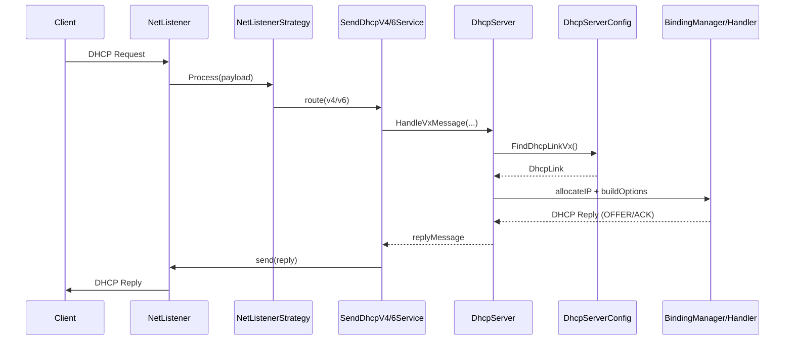

# PIXIS DHCP 結構筆記

## 1. 主要類別 / 資料結構

| 層級     | 檔案/類別                                                              | 角色                                                                                                                                              | 關鍵成員                                            |
| -------- | ---------------------------------------------------------------------- | ------------------------------------------------------------------------------------------------------------------------------------------------- | --------------------------------------------------- |
| ➊ 規格層 | `ConfigClass.cs` <br/>partial class **`link`**                         | - XSD→C# 自動產生 <br/>- 1:1 對應 `<link>` XML 節點 <br/>- 純資料、無邏輯                                                                         | `v4/v6*Pools`、`*ConfigOptions`、`linkFilters`…     |
| ➋ 執行層 | `DhcpLink.cs` <br/>class **`DhcpLink`**                                | - 封裝 **link** + **Subnet** <br/>- 快取/解析 Options <br/>- 提供 Run-Time 方法 (`Contains`, `GetV4ConfigOptions` …)                              | `link`、`subnet`、多個 `DhcpVxConfigOptions`        |
| ➌ 工具層 | `Subnet.cs` <br/>class **`Subnet`**                                    | - 保存 `subnetAddress + prefixLength` <br/>- `Contains(IP)`、`CompareTo()`                                                                        | `Contains`、`GetEndAddress`                         |
| ➍ 組態層 | `DhcpServerConfiguration.cs` <br/>class **`DhcpServerConfiguration`**  | - 啟動時將所有 `<link>`→`DhcpLink` <br/>- 建立 `linkMap : Dictionary<Subnet, DhcpLink>` <br/>- 提供快速查詢 / Filter-Option 計算 / Pool 管理      | `linkMap`、`FindDhcpLinkV4/V6`、`Effective*Options` |
| ➎ 服務層 | `DhcpServer.cs` <br/>class **`DhcpServer`** (implements `IDhcpServer`) | - 對 Probe 提供 API (Init、HandleV4/6Message…) <br/>- 呼叫 ➍ 查表 → 交給 Handler/BindingManager 做分配 <br/>- 統一管理租約、靜態綁定、Pool Policy | `HandleV4Message`、`HandleV6Message`、`Init`        |

---

## 2. 啟動流程

1. **反序列化 XML**  
   XSD-generated 類別把 `dhcpServerConfig.xml` 讀成 `dhcpServerConfig` 物件，內含多個 `link` 節點。

2. **建立 `DhcpLink` 與 `linkMap`**

   ```csharp
   foreach (link l in xml.links) {
       Subnet s      = new Subnet(l.Address);
       DhcpLink dl   = new DhcpLink(s, l);
       linkMap[s]    = dl;             // 存入 Dictionary
   }
   ```

3. **初始化 BindingManager**  
   `DhcpServerConfiguration` 透過 `Factory` 建好 V4/V6 BindingManager，並設定 CheckIP / Policy 等委派。

4. **Probe 啟用 DHCP Server**
   ```csharp
   _dhcpServer.Init(initData, mainProbeMac);
   ```

---

## 3. 封包處理流程

### 3-1. 封包處理流程（詳細 + 郵局比喻）

#### 3-1-1 比喻對照表

| 真實流程                                 | 郵局比喻                             |
| ---------------------------------------- | ------------------------------------ |
| Client 送出 DHCP DISCOVER / SOLICIT      | 客戶把「我要寄貨」的包裹丟到郵筒     |
| `NetListener` 擷取封包                   | 郵差把包裹從郵筒收走                 |
| `NetListenerStrategy` 判斷 v4 / v6       | 郵差看包裹是「國內件」還是「國際件」 |
| 呼叫 `SendDhcpV4/6Service`               | 包裹進入國內或國際分流線             |
| `DhcpServer.HandleVxMessage`             | 送到分流中心總控室                   |
| `DhcpServerConfiguration.FindDhcpLinkVx` | 總控室依 ZIP Code 選滑道             |
| `BindingManager` 分配位址 / 組 Option    | 分流滑道貼正確地址標籤、生成單號     |
| 回傳 OFFER / ADVERTISE                   | 包裹帶著新標籤回到郵差手上           |
| `NetSender` 發送封包                     | 郵差把包裹送回客戶或下一站           |

---

#### 3-1-2 實際呼叫順序



---

#### 3-1-3 關鍵節點說明

| 節點                                 | 責任                     | 常見調試點                          |
| ------------------------------------ | ------------------------ | ----------------------------------- |
| `FindDhcpLinkV4/V6`                  | 由 **IP** 找 `DhcpLink`  | `linkMap` 未建或子網不匹配導致 null |
| `BindingManager.GetNextFreeAddress`  | 決定派哪個 IP            | Pool 用盡、Policy 限制              |
| `Filtered*Options`                   | 根據 Filter 加/換 Option | Client/Vendor Class 不符            |
| 委派 `IsBlockedIP / IsRegisteredMAC` | 安控整合                 | DI 未注入 delegate                  |

---

#### 3-1-4 小結

- **郵差 = NetListener**：收發封包，不碰業務。
- **總控室 = DhcpServer**：決定走哪條滑道。
- **滑道工人 = BindingManager + MessageHandler**：真正貼標籤、分配地址。
- **地址簿 = linkMap**：ZIP Code (IP/Subnet) → 滑道 (DhcpLink)。
- **地址標籤 = DhcpOption**：最終寫在封包裡的各種 Option。

這樣串起來，就能把一次 DHCP 封包在 PIXIS 裡的旅程想像成包裹在郵局分流中心的流向。

---

## 4. 為何同時需要 `Subnet` 與 `linkMap`

- **`Subnet`** — 單一網段的定位資料，封裝在 `DhcpLink` 內供方法使用。
- **`linkMap`** — 所有 `DhcpLink` 的集中索引表：
  - O(1)/O(logN) 由 IP 找到對應 `DhcpLink`
  - 統一管理 Pool / Policy 更新、遍歷、統計。

> 因此 `Subnet` 屬於物件本身，`linkMap` 屬於「全域查詢與管理層」，兩者並不重複。

---

## 5. IPv4 支援的由來

1. Jagornet 原生僅 DHCPv6 → PIXIS 依其架構自行實作 `V4Process` 系列。
2. XML Schema 擴充 v4 節點 (`v4AddressPool`, `v4ConfigOptionsType`…)。
3. 新增 `DhcpV4MessageHandler`, `V4AddrBindingManager`, `DhcpV4*Processor` 等模組。
4. 透過同一份 `DhcpServerConfiguration` 與 `DhcpServer`，實現 **IPv4 + IPv6** 混合派發。

---

## 6. 一句話總結

> **PIXIS DHCP** = Jagornet DHCPv6 架構 + PIXIS 自行實作 IPv4 支援，完整移植為 C#，並嵌入 Probe 的網路偵測／管控系統。
